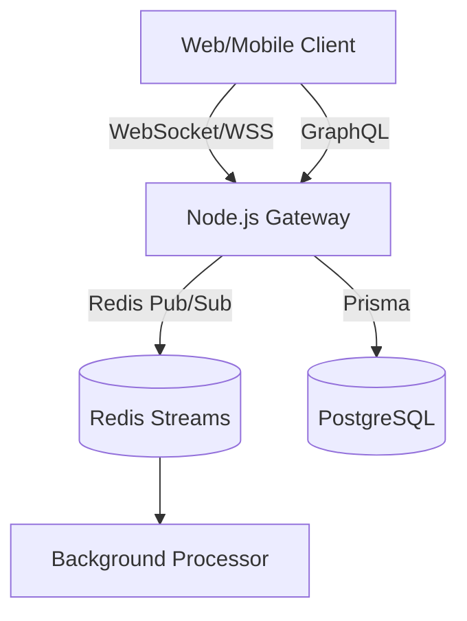

# TS-GraphQL-Server


A robust GraphQL API Gateway serving as the primary data graph for web and mobile clients, featuring GraphiQL introspection and mutation handling.

## System Architecture





## Elite Features
- **Strongly Typed Schema**: Native GraphQL schema definition.
- **Federation Ready**: Structured to support Apollo Federation.
- **GraphiQL Interface**: Built-in developer tooling for query testing.

## Quick Start
```bash
docker-compose up -d redis
npm ci
npm test
npm run build && npm start
```
